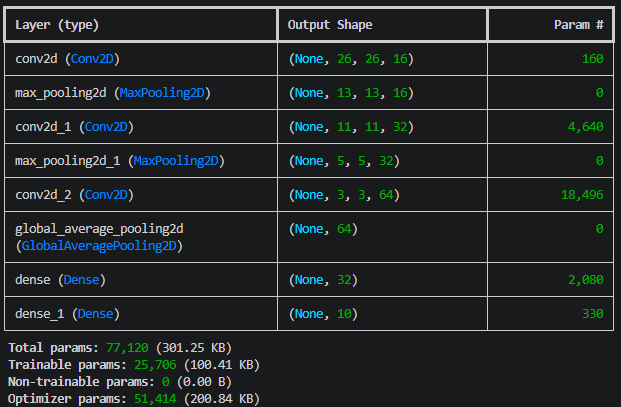
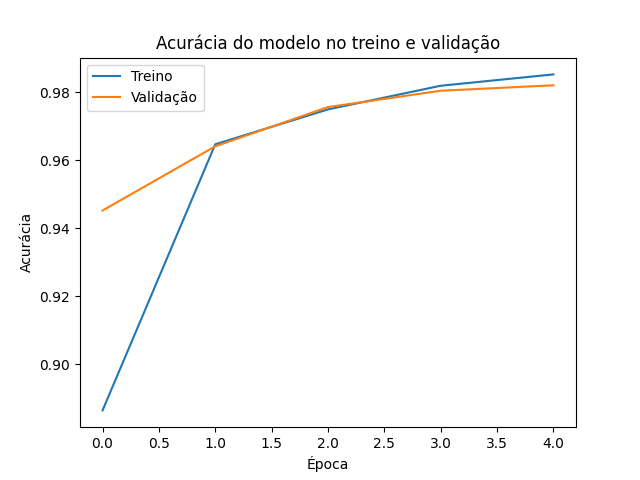
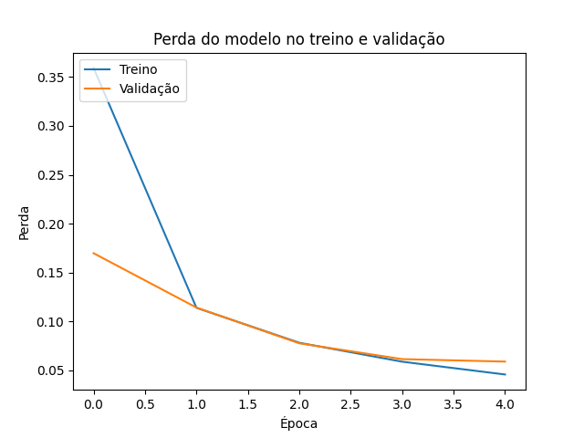
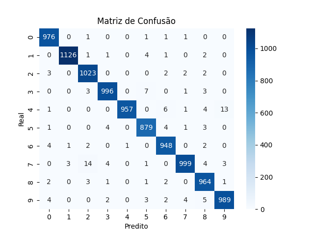

# Processo Seletivo – Intensivo Maker | AI

👤 Identificação: **Arthur Lobo Feitosa de Oliveira**


# Visão Geral do Projeto

Este projeto consiste no desenvolvimento de uma Rede Neural Convolucional (CNN) para classificação de dígitos (0–9), seguido de sua otimização para execução em ambientes com recursos limitados (edge) utilizando TensorFlow Lite.

O foco não foi apenas obter alta acurácia, mas também explorar o equilíbrio entre:

- Desempenho
- Custo computacional
- Tamanho do modelo

O pipeline completo inclui:

1. Preparação dos dados
2. Treinamento da CNN
3. Avaliação (incluindo matriz de confusão)
4. Conversão e otimização para TensorFlow Lite


# 1️⃣ Arquitetura do Modelo

Definida em `train_model.py`.

A arquitetura foi projetada para ser **leve e eficiente**, adequada para uso em edge.


## 🔹 Extração de características

* `Conv2D(16, 3x3, ReLU)`
* `MaxPooling2D(2x2)`

Captura padrões básicos como bordas e formas simples.

* `Conv2D(32, 3x3, ReLU)`
* `MaxPooling2D(2x2)`

Captura padrões intermediários como curvas e junções.

* `Conv2D(64, 3x3, ReLU)`

Captura características mais complexas dos dígitos.


## 🔹 Redução de dimensionalidade

* `GlobalAveragePooling2D()`

Substitui o uso de Flatten, reduzindo drasticamente o número de parâmetros e tornando o modelo mais eficiente para dispositivos com pouca memória.


## 🔹 Classificação

* `Dense(32, ReLU)`
* `Dense(10, Softmax)`

Realiza a classificação final dos dígitos.

## 🔹 Resumo do modelo no terminal




# 2️⃣ Treinamento

O modelo então é treinado em 5 épocas com as amostras de dados dedicadas, com as seguintes configurações:

* Otimizador: Adam (`learning_rate = 0.001`)
* Função de perda: `sparse_categorical_crossentropy`
* Métrica: `accuracy`

Ao fim de cada época, são coletados os valores da precisão e perda de treinamento e de validação, respectivamente, para serem exibidos ao final.

Observamos valores de acurácia de validação elevados (>90%) até mesmo ao final da primeira época, convergindo rapidamente a valores próximos de 98% até o final do treinamento.







# 3️⃣ Avaliação do Modelo

Após o treinamento:

* Avaliação no conjunto de teste
* Geração da **matriz de confusão**

## 🔹 Matriz de confusão

Permite identificar:

* Quais dígitos são mais confundidos
* Padrões de erro do modelo

Visualizada usando Seaborn.




# 4️⃣ Otimização para TensorFlow Lite

Definida em `optimize_model.py`.

O projeto aplica **duas técnicas de quantização pós-treinamento**:


### 🔹 1. Dynamic Range Quantization

```python
converter.optimizations = [tf.lite.Optimize.DEFAULT]
```

### Características:

* Converte pesos para int8
* Não requer dataset representativo
* Redução significativa de tamanho

E então é salvo como `model.tflite`.


### 🔹 2. Quantização Float16

```python
converter.target_spec.supported_types = [tf.float16]
```

### Características:

* Reduz pesos de float32 → float16
* Mantém alta precisão
* Ideal para GPU e dispositivos com suporte a float16

Salvo como `model_float16.tflite`


# 5️⃣ Resultados Obtidos

* Acurácia final: **~98%**
* Loss final: **~0.05**

### 🔹 Observações:

* Alta performance já nas primeiras épocas (próximos de 90%)
* Ganhos marginais nas épocas seguintes
* Modelo converge rapidamente

# 6️⃣ Decisões de Projeto

### Uso de GlobalAveragePooling

* Reduz número de parâmetros
* Melhora eficiência para edge
* Evita overfitting comparado ao Flatten

### Arquitetura compacta

* Poucas camadas
* Filtros pequenos (3x3)
* Baixo custo computacional

### Quantização pós-treinamento

* Permite deploy eficiente sem re-treinamento


#  7️⃣ Possíveis Melhorias

* Quantização inteira (int8) com dataset representativo
* Uso de Depthwise Separable Convolutions (MobileNet-style)
* Aplicação de pruning
* Avaliação de latência em hardware real


#  8️⃣ Aprendizados

* Construção completa de pipeline de ML
* Funcionamento de CNNs na prática
* Importância da validação
* Técnicas de otimização para edge (TFLite)


# 9️⃣ Dificuldades

* Entendimento inicial do fluxo com TensorFlow/Keras
* Configuração correta do pipeline de dados
* Interpretação das métricas de validação


# 🔟 Conclusão

O projeto demonstra a construção de uma CNN eficiente e sua adaptação para execução em dispositivos com recursos limitados, mantendo alta acurácia e baixo custo computacional.
